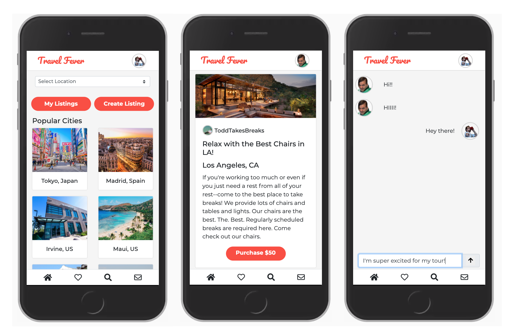

# travel-fever

## About 
 Travel Fever is an application for travelers who want to connect with locals to get personalized travel information, itineraries, and tours in a marketplace. 
 * Users can create listings, view other users listings, buy a listing, and message a seller once they complete a purchase. 
 
## Live Link 
https://travel-fever.ninajhun.com/

## Technologies Used
* React.js
* Node.js
* Express
* PostgreSQL
* Bootstrap 4
* HTML5
* CSS3
* AWS EC2

## Getting Started
1. Clone the repo and navigate to the directory
```shell 
git clone https://github.com/ninajhun/travel-fever.git
cd travel-fever
```
2. Install all dependencies
 ``` shell
 npm install
 ```

3. Start your PostgreSQL server
```shell 
sudo service postgresql start
```

4. Import existing database
```shell 
npm run db:import
```

5. Compile project
```shell 
npm run dev
```
6. Access application by going to [https://localhost:3000](https://localhost:3000) in the browser

## Preview



